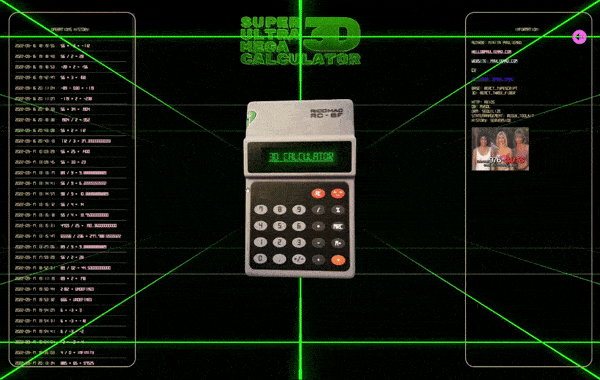

# <div align="center">React Three Calculator</div>


# <div align="center">[Live Demo](https://pavlienko.com/projects/three-calculator)</div>

<!-- - **Buttons count:**
  - width: **4** blocks
  - height: **5** blocks -->

## Description

### LAZY ROTATION ADDED



Calculator implemented by scratch on React.js.
It contains all types of operations (which exists on original Ricomac RC-8F),and one edited button. I've learned web development myself without any course or coaching so don't expect too much from the source code xD.

## About project

## Project setup

```
  npm install
  npm start
```
## Future scope

  - Add enemies from doom
  - Easter eggs
  - Make editable background fragment shader and add it to the main screen

<!-- ## Support on  -->
