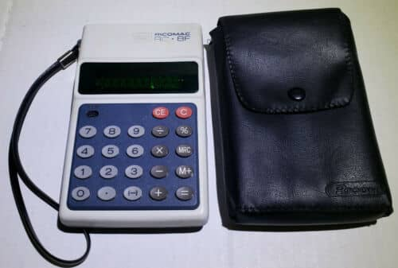

# <div align="center">React Three Calculator</div>

<div align="center"/>

</div>

# <div align="center">[Live Demo](https://pavlienko.github.io/react-three-calculator)</div>

<!-- - **Buttons count:**
  - width: **4** blocks
  - height: **5** blocks -->

## Description

### LAZY ROTATION ADDED

<center>


</center>

Calculator implemented by scratch on React.js.
It contains all types of operations (which exists on original Ricomac RC-8F),and one edited button. I've learned web development myself without any course or coaching so don't expect too much from the source code xD.

## About project


This project was developed to demonstrate the simple idea of ​​a retro 3d calculator "RICOMAC RC-8F" with all math operations by using the React Three Fiber and Redux Toolkit libraries.
<br />


- ### History:

All history information is stored on the server.
To update MySQL DB calculator sends POST requests to server API and then waiting for server reply before updating the result sign.

- ### Buttons:
Buttons placed proceduraly from an array, and then marked as ```DOM Components``` by using ```"Html"``` <br /> from ```React Three Drei``` library.
<br />
<br />
**(There is a problem right now, that CSS3DRENDERER and useFrame are ASYNC in R3F and you may see the delay between moving ```3D``` and ```html```)**

- ### Meaning of buttons:
```
AC  --- clears the store and all existing operations
```
```
^_^ --- link button to the personal site
```
```
MRC --- stores the actual signs with operators if they exist, 
        and can also erase itself if the actual store is equal 
        to the existing signs
```
```
M+  --- clears the store, and replace empty store with existing signs
```
```
+/- --- replaces actual fragment of signs with inversed number  
```

## Project setup

```
  npm install
  npm start
```
## Future scope
  - Add loader ...
  - Add enemies from doom
  - Easter eggs
  - Make editable background fragment shader and add it to the main screen

<!-- ## Support on  -->
___
#### [pavlienko.com](https://pavlienko.com)
